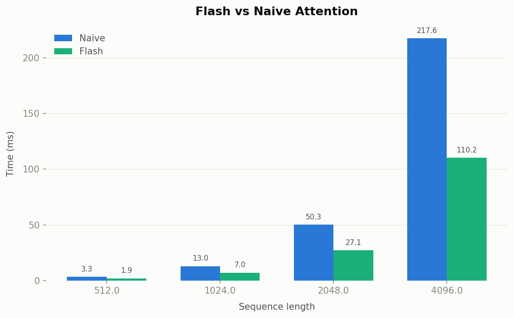

# PyTorch & Triton from Scratch

Implementations of core deep learning primitives built from scratch using PyTorch and Triton, culminating in a GPT-style language model trained on TinyStories.

Each module implements both the forward and backward pass manually via `torch.autograd.Function` — no relying on PyTorch's autograd for the core computation. Gradients are derived and verified against PyTorch's reference implementations using `gradcheck` and direct gradient comparison.

## What's implemented

### Modules (`modules/`)
| Module | Notes |
|---|---|
| `Linear` | Forward + backward via `torch.autograd.Function` |
| `LayerNorm` | With optional bias |
| `Embedding` | Token embedding table |
| `ReLU` | Custom autograd function |
| `CrossEntropyLoss` | Numerically stable via log-sum-exp |
| `RotaryPositionalEmbeddings` | RoPE applied to Q/K in attention |
| `MultiheadAttention` | Supports standard and flash attention paths, causal masking, key-padding mask |
| `TransformerBlock` | Pre-norm transformer block (LayerNorm → MHA → LayerNorm → FFN) |
| `LanguageModel` | Full GPT-style model: embedding → N transformer blocks → LM head |

### Triton Kernels (`modules/kernels/`)
| Kernel | Notes |
|---|---|
| `VectorAdd` | Introductory element-wise kernel |
| `MatMul` | Tiled matrix multiplication |
| `FusedSoftmax` | Row-wise softmax fused into a single kernel |
| `FlashAttention` | FA2-style forward + backward with online softmax, batch/head support, causal masking |

### Optimizer (`optim/`)
- `AdamW` — weight decay decoupled from the adaptive update

## Flash Attention

The flash attention kernel (`modules/kernels/FlashAttention.py`) implements the FA2 algorithm in Triton:

- **Tiled computation** — Q is tiled across the grid; each program iterates over KV tiles, accumulating output without materialising the full N×N attention matrix
- **Online softmax** — running max and log-sum-exp updated incrementally so only SRAM is needed for the working set
- **Batch and head dimensions** — 3D launch grid `(cdiv(N_Q, BLOCK_Q), HEADS, BATCH)` with pointer offsets per block
- **Causal masking** — `is_causal: tl.constexpr` compiles two specialised kernel versions at compile time; the forward loop is capped at `kv_end = min((pid+1)*BLOCK_Q, N_KV)` to skip future tokens; the backward Q loop starts at `pid * BLOCK_KV`
- **Backward pass** — outer KV loop, inner Q loop; `D = rowsum(dO ⊙ O)` precomputed; `tl.atomic_add` for dQ accumulation; `reset_to_zero=['dq_ptr']` in autotune to prevent accumulation across benchmark runs
- **Autotuning** — block sizes `{16, 32} × {16, 32}`, warps `{2, 4, 8}`, pipeline stages `{2, 3, 4}` searched per `(N_Q, N_KV, DIM)` shape

### Benchmark

Flash vs naive attention forward pass, measured with `torch.cuda.Event` timing (post-autotune warmup). Config: batch=2, 32 heads, 64 head dim, non-causal, on NVIDIA V100.



Flash attention speedup grows with sequence length as the O(N²) memory savings from avoiding the full attention matrix become dominant. At shorter sequences the tiled kernel overhead is comparable to naive cuBLAS matmul.

To run the benchmark:
```bash
python benchmark/benchmark_flash_attn.py \
    -b 2 -H 32 -d 64 \
    -s 512 1024 2048 4096 \
    --fig_path figs/flash_vs_naive_attn.png
```

Profile with Nsight Systems:
```bash
nsys profile \
    --capture-range cudaProfilerApi \
    --capture-range-end stop \
    -o report \
    python benchmark/benchmark_flash_attn.py -b 2 -H 32 -d 64
```

## Running tests

```bash
pytest tests/
```

Tests cover forward correctness (vs `torch.nn` reference), gradient correctness (vs autograd or `torch.autograd.gradcheck`), and flash attention forward/backward against the naive reference at multiple shapes including causal variants.

## Training

```bash
python train/train.py
```

Trains a GPT-style model on the TinyStories dataset. Data preprocessing (tokenisation with `tiktoken`, binary `.bin` files) is in `data/preprocess.py`.

## Requirements

```
torch, triton, numpy, tiktoken, pyarrow, huggingface-hub, matplotlib, pandas, pytest
```

```bash
pip install -r requirements.txt
```
